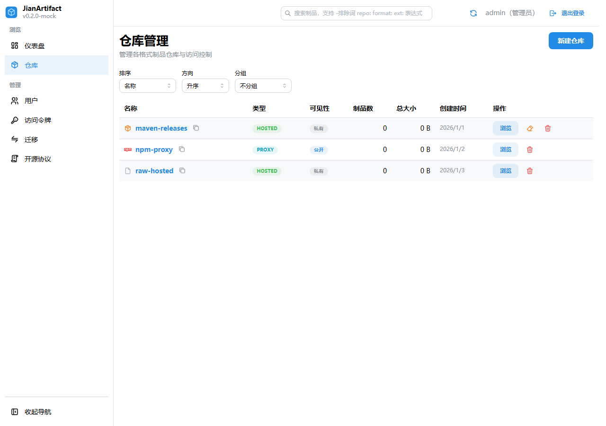
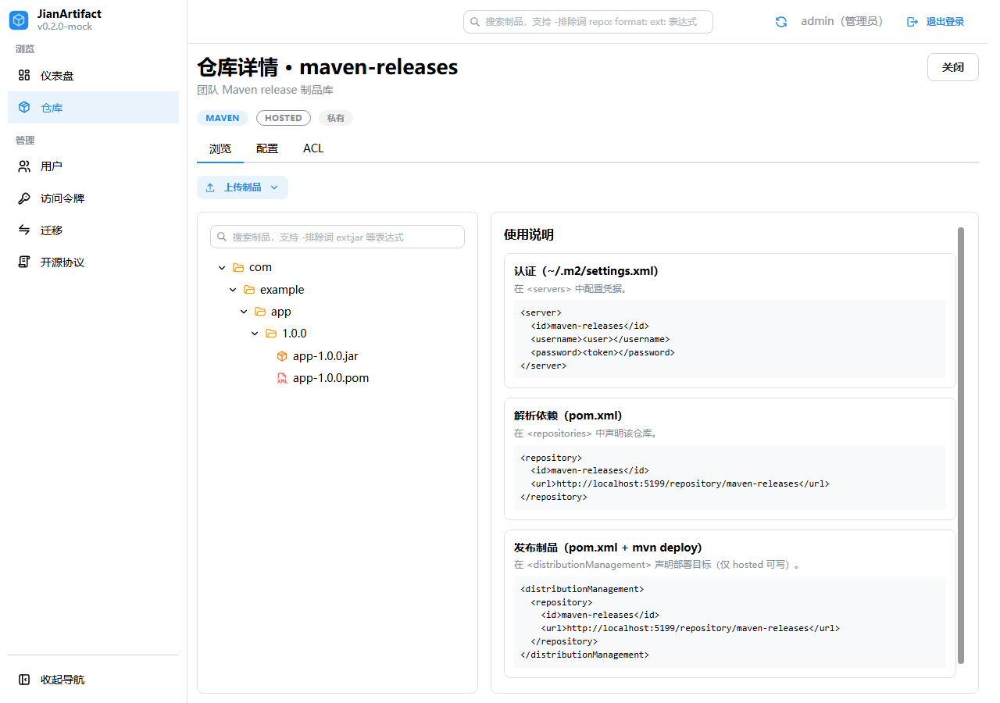
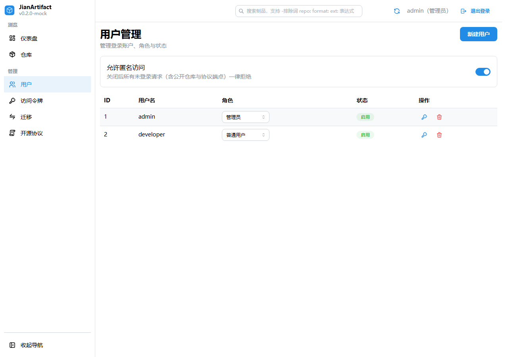
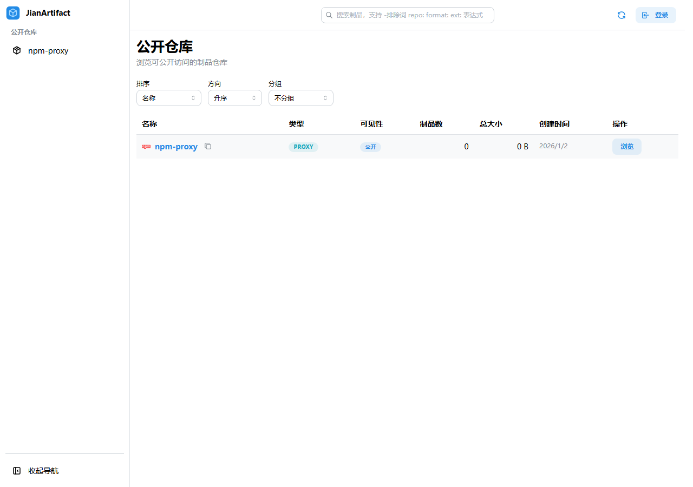

# JianArtifact

> 自托管、单二进制交付的多格式制品仓库（artifact repository），用 Go 重写，支持从 Nexus OSS 平滑迁移。

[](https://github.com/wcpe/JianArtifact/actions/workflows/ci.yml)
[](https://github.com/wcpe/JianArtifact/actions/workflows/release.yml)


一个二进制、开箱即用、可从 Nexus 迁移的轻量私有制品库——默认无需外部数据库 / 对象存储 / 中间件即可跑起来，同时保留向企业场景（OIDC/LDAP、S3、HA）演进的路径。

## 截图（mock 模式）

管理端与制品浏览界面，数据由 devmock 内存态模拟（不依赖真实后端）：

| 仓库管理                                                 | 制品浏览                                                    |
| -------------------------------------------------------- | ----------------------------------------------------------- |
|  |  |

| 用户与匿名访问                                          | 匿名公开浏览                                           |
| ------------------------------------------------------- | ------------------------------------------------------ |
|  |  |

## 特性

- **多格式仓库**：Raw / Maven / npm / Docker(OCI) / Cargo / PyPI / Go modules / NuGet，均为 hosted + proxy + group（group 视格式支持）；支持按格式声明式启停（未启用格式零路由零后台任务）。
- **从 Nexus OSS 平滑迁移**：在线 REST / 离线原生目录 / 自有离线包三来源，计划预览、幂等续传、冲突策略与迁移报告；drop-in URL 兼容让客户端只改 host。
- **认证与授权**：管理员网页自举、JWT 会话、API Token（CI/CLI 鉴权）、用户 / 仓库 / ACL 管理，内置 anonymous 主体 + 实例级匿名访问开关。
- **全局搜索**：跨仓库制品搜索 + Header 搜索栏，支持 `repo:` / `format:` / `ext:` 等高级表达式与浏览页内过滤。
- **制品治理**：内容寻址 blob 存储 + 校验和，single-flight 并发合并，大文件全程流式。
- **单二进制交付**：前端产物经 Go embed 内嵌，`CGO_ENABLED=0` 静态编译，零外部依赖；Docker / Compose / systemd 多路径部署。
- **搬迁与备份（0.8.0 起）**：节点搬迁以**一致性备份包**为传输单位（`manifest.json` + `VACUUM INTO` 快照 + `blobs.index` + 内容寻址 blob，包内不含任何密钥）；支持热备份与冻结窗口两种生成模式、增量差包、带时效签名的**无登录下载**（支持 Range 续传）、三通道导入（CLI / URL 拉取含 SSRF 防护 / 8 MiB 分片上传）与「暂存 + 重启原子替换」。
- **写入冻结窗口**：运行时可冻结写入（有界 TTL、超时自动解冻），冻结期业务写返回 `503 write_frozen`、读与登录放行，界面显著提示，用于搬迁的短停机切换。
- **运维可观测**：当前节点审计中心（八维筛选 + 风险批次确认）、业务仪表盘、当前主机监控（每分钟采样、保留 30 天）、管理端页面数据缓存。
- **端口防护**：允许访问域名白名单、回源 Token 校验与服务内置 TLS 双监听。

## 快速开始

```bash
make install    # 安装前端依赖（pnpm workspace）
make dev        # 本地开发（前端 + 后端）
make check      # 在 Docker 中运行全部质量门
pwsh -NoProfile -ExecutionPolicy Bypass -File scripts/check.ps1  # Windows 原生质量门
make build      # 前端构建 + 后端 embed 编译单二进制
make release    # 产出多平台发布物（校验和 / 签名 / SBOM）
```

后端任务经 Go Task 编排（`task gen`=oapi-codegen、`task lint/test/vet/vuln`、`task build`）。部署见 [`docs/OPERATIONS.md`](docs/OPERATIONS.md)。

## 结构

```
apps/{server,web,wiki}        后端 / 管理端 / 组件验收站
packages/{ui,devmock,eslint-config,typescript-config}  前端共享
api/openapi.yaml              API 契约唯一真源
deploy/                       Dockerfile / compose / .env.example / 部署脚本 / helm / k8s / systemd
docs/                         PRD / ARCHITECTURE / API / ROADMAP / ADR / specs / OPERATIONS
scripts/                      质量门与容器化开发入口
Makefile · Taskfile.yml       前端顶层入口 / 后端任务编排
```

## 文档导航

- 文档总览：[`docs/README.md`](docs/README.md)
- 需求：[`docs/PRD.md`](docs/PRD.md)
- 架构：[`docs/ARCHITECTURE.md`](docs/ARCHITECTURE.md)
- 接口：[`docs/API.md`](docs/API.md)
- 路线图：[`docs/ROADMAP.md`](docs/ROADMAP.md)
- 运维：[`docs/OPERATIONS.md`](docs/OPERATIONS.md)
- 安全：[`SECURITY.md`](SECURITY.md)
- 决策：[`docs/adr/`](docs/adr/)
- 演进与维护：[`docs/CONTRIBUTING.md`](docs/CONTRIBUTING.md)
- 变更史：[`CHANGELOG.md`](CHANGELOG.md)

## 约定

提交、分支、文档同步等约定见 [`docs/CONTRIBUTING.md`](docs/CONTRIBUTING.md) 与 `.claude/rules/`。本项目遵循 SDD（规格驱动开发）：需求先行、文档即代码、跨会话不漂移；API 以 `api/openapi.yaml` 为唯一真源，`oapi-codegen` 生成后端接口、前端生成 client、devmock 据同一契约比对防漂移。

## 许可

[MIT](LICENSE)。
