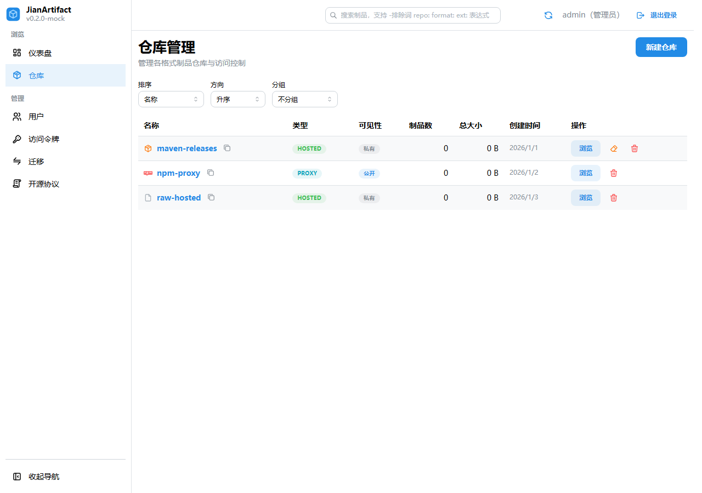
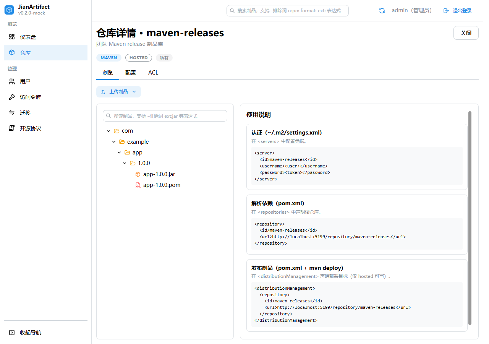
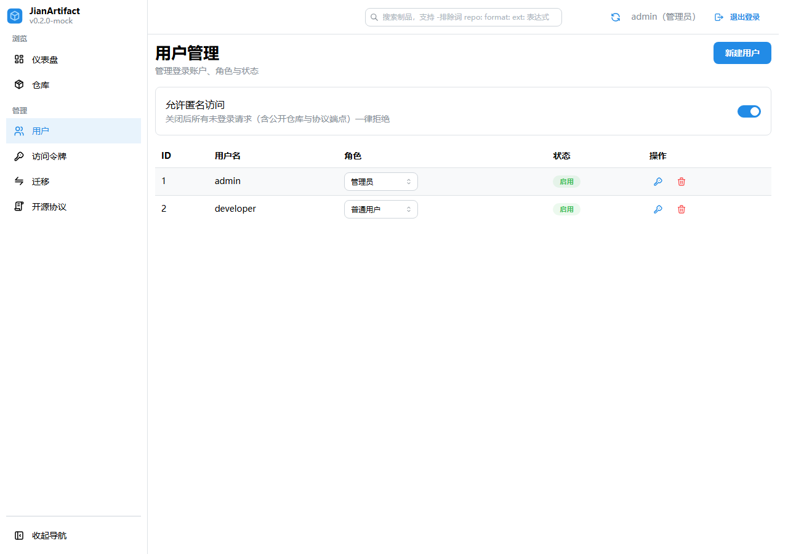
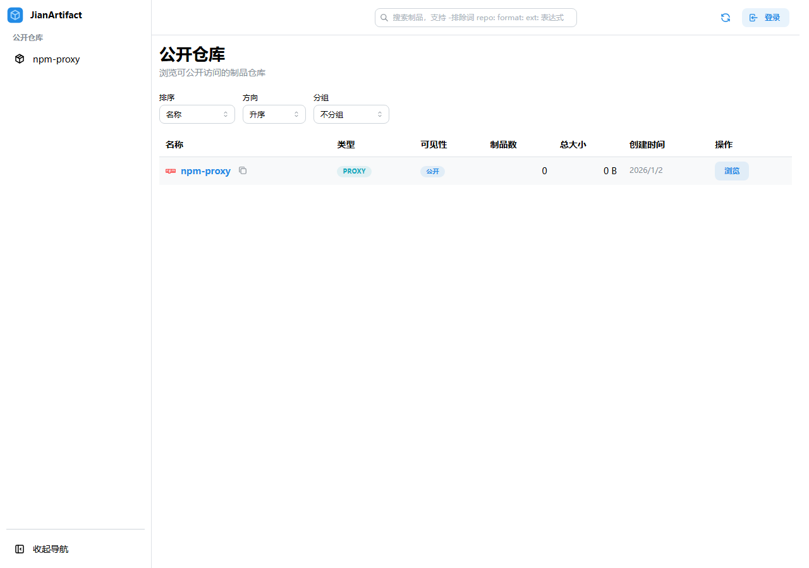

# JianArtifact

> 自托管、单二进制交付的多格式制品仓库（artifact repository），用 Go 重写，支持从 Nexus OSS 平滑迁移。

[](https://github.com/wcpe/JianArtifact/actions/workflows/ci.yml)
[](https://github.com/wcpe/JianArtifact/actions/workflows/release.yml)


**一个二进制、开箱即用、可从 Nexus 迁移的轻量私有制品库**——默认无需外部数据库 / 对象存储 / 中间件即可跑起来，同时保留向企业场景（OIDC/LDAP、HA）演进的路径。

> 版本徽章为发布时的静态标注，**当前版本以根目录 [`VERSION`](VERSION) 为唯一真源**；各版本交付范围见 [`docs/ROADMAP.md`](docs/ROADMAP.md)。

## 目录

- [为什么用它](#为什么用它)
- [支持的能力](#支持的能力)
- [截图](#截图)
- [快速开始](#快速开始)
- [部署形态](#部署形态)
- [项目结构](#项目结构)
- [文档导航](#文档导航)
- [参与与约定](#参与与约定)
- [许可](#许可)

## 为什么用它

| 维度             | 说明                                                                                                                                                     |
| ---------------- | -------------------------------------------------------------------------------------------------------------------------------------------------------- |
| **零外部依赖**   | 默认形态不需要外部 DB / MQ / 对象存储；一个二进制或一个容器即可运行。元数据落 SQLite、制品内容落文件系统（内容寻址），二者真源边界清晰。                 |
| **单二进制交付** | 前端产物经 Go embed 内嵌；`CGO_ENABLED=0` 静态编译，交叉编译即得各平台产物，无运行时依赖。                                                               |
| **迁移友好**     | 三来源从 Nexus OSS 3.70.x 迁移（在线 REST / 离线原生目录 / 自有离线包），支持计划预览、幂等续传、冲突策略与迁移报告；drop-in URL 兼容让客户端只改 host。 |
| **格式覆盖广**   | 8 种格式，均支持 hosted + proxy + group，可按格式声明式启停（未启用格式零路由、零后台任务）。                                                            |
| **企业可接入**   | OIDC / LDAP 登录、用户组与细粒度权限动作、审计日志、Prometheus 指标、配额与保留策略。                                                                    |
| **运维可控**     | 搬迁以一致性备份包为单位；写入冻结窗口支撑短停机切换；当前节点审计中心与主机监控；端口级防护（域名白名单 / 回源 Token / 内置 TLS）。                     |

## 支持的能力

### 仓库格式

支持 8 种格式，均提供 hosted（本地托管）与 proxy（代理回源）：`raw`、`maven`、`npm`、`docker`(OCI)、`cargo`、`pypi`、`gomod`、`nuget`。

group（聚合多个成员、对外暴露单一地址）同样支持，成员须与本仓同格式；其中 Maven 与 npm 另有元数据合并语义（如 `maven-metadata.xml` 版本列表、packument 首成员优先合并）。

按格式启停由 `JIAN_ENABLED_FORMATS` 控制（默认 `raw,maven,npm` 以兼容既有部署），未启用的格式零路由、零后台任务。

### 管理与运维能力

- **认证与授权**：管理员网页自举、JWT 会话、API Token（CI/CLI 鉴权）、用户 / 用户组 / 仓库 ACL 管理；仓库动作细分为 `read` / `write` / `publish` / `delete` / `acl_manage` / `admin` 六档，可分别授予「只能发布、不能下载」这类最小权限；内置 anonymous 主体与实例级匿名访问开关。
- **全局搜索**：跨仓库制品搜索 + Header 搜索栏，支持 `repo:` / `format:` / `ext:` 等高级表达式与浏览页内过滤；结果可直达仓库命中位置。
- **制品治理**：内容寻址 blob 存储 + 校验和，single-flight 并发合并，大文件全程流式；仓库级存储配额、代理缓存保留、周期清理作业与可恢复的隔离回收。
- **上游健康**：proxy 上游失败自动阻止（退避窗口每档翻倍），窗口到期以半开闸门只放行一个探测请求，恢复后自动放行；上游状态在仓库列表 / 详情 / 观测页可见，支持手动重测与 online/offline。
- **搬迁与备份**：以**一致性备份包**为传输单位（`manifest.json` + `VACUUM INTO` 快照 + `blobs.index` + 内容寻址 blob，**包内不含任何密钥**）；支持热备份与冻结窗口两种生成模式、增量差包、带时效签名的**无登录下载**（支持 Range 续传）、三通道导入（CLI / URL 拉取含 SSRF 防护 / 分片上传）与「暂存 + 重启原子替换」。
- **写入冻结窗口**：运行时可冻结写入（有界 TTL、超时自动解冻），冻结期业务写返回 `503 write_frozen`、读与登录放行，界面显著提示，用于搬迁的短停机切换。
- **运维可观测**：当前节点审计中心（八维筛选 + 风险批次确认）、业务仪表盘与下载分析、当前主机监控（每分钟采样、保留 30 天）、管理端页面数据缓存。
- **运行时配置**：OIDC / LDAP 身份源、Prometheus `/metrics` 指标端点、存储清理与备份相关参数、可热改的服务设置。

### 发布产物

Release 附带以下目标与校验和：`linux/amd64`、`linux/arm64`、`windows/amd64`、`darwin/amd64`、`darwin/arm64`。

## 截图

管理端与制品浏览界面，数据由 devmock 内存态模拟（不依赖真实后端）：

| 仓库管理                                                 | 制品浏览                                                    |
| -------------------------------------------------------- | ----------------------------------------------------------- |
|  |  |

| 用户与匿名访问                                          | 匿名公开浏览                                           |
| ------------------------------------------------------- | ------------------------------------------------------ |
|  |  |

## 快速开始

```bash
make install    # 安装前端依赖（pnpm workspace）
make dev        # 本地开发（前端 + 后端）
make check      # 运行全部质量门（Windows 自动选 PowerShell，其它平台用容器）
make build      # 前端构建 + 后端 embed 编译单二进制
make release    # 产出多平台发布物（校验和 / 签名 / SBOM）
```

Windows 上直接跑原生质量门：

```powershell
pwsh -NoProfile -ExecutionPolicy Bypass -File scripts/check.ps1
```

后端任务经 Go Task 编排（`task gen` = oapi-codegen、`task lint/test/vet/vuln`、`task build`）。`make help` 可列出全部目标。

## 部署形态

- **Docker / Compose**：`deploy/docker-compose.yml` 与 `deploy/Dockerfile`
- **systemd**：`deploy/systemd/`，配合 `deploy/remote-ssh.sh` 做远程发布与回滚
- **Kubernetes / Helm**：`deploy/helm/`、`deploy/k8s/`
- **裸机二进制**：从 Release 下载对应平台产物直接运行

环境变量模板见 [`deploy/.env.example`](deploy/.env.example)；完整部署、升级与排障见 [`docs/OPERATIONS.md`](docs/OPERATIONS.md)。

## 项目结构

```
apps/{server,web,wiki}        后端 / 管理端 / 组件验收站
packages/{ui,devmock,eslint-config,typescript-config}  前端共享
api/openapi.yaml              API 契约唯一真源
deploy/                       Dockerfile / compose / .env.example / 部署脚本 / helm / k8s / systemd
docs/                         PRD / ARCHITECTURE / API / ROADMAP / ADR / specs / OPERATIONS
scripts/                      质量门与容器化开发入口
Makefile · Taskfile.yml       前端顶层入口 / 后端任务编排
```

## 文档导航

| 想了解       | 看这里                                         |
| ------------ | ---------------------------------------------- |
| 文档总览     | [`docs/README.md`](docs/README.md)             |
| 产品需求     | [`docs/PRD.md`](docs/PRD.md)                   |
| 系统架构     | [`docs/ARCHITECTURE.md`](docs/ARCHITECTURE.md) |
| 接口说明     | [`docs/API.md`](docs/API.md)                   |
| 版本路线图   | [`docs/ROADMAP.md`](docs/ROADMAP.md)           |
| 部署运维     | [`docs/OPERATIONS.md`](docs/OPERATIONS.md)     |
| 架构决策记录 | [`docs/adr/`](docs/adr/)                       |
| 功能规格     | [`docs/specs/`](docs/specs/)                   |
| 变更历史     | [`CHANGELOG.md`](CHANGELOG.md)                 |
| 安全策略     | [`SECURITY.md`](SECURITY.md)                   |
| 参与贡献     | [`docs/CONTRIBUTING.md`](docs/CONTRIBUTING.md) |

## 参与与约定

提交、分支、文档同步等约定见 [`docs/CONTRIBUTING.md`](docs/CONTRIBUTING.md) 与 [`.claude/rules/`](.claude/rules/)。

本项目遵循 **SDD（规格驱动开发）**：需求先行、文档即代码、跨会话不漂移。API 以 [`api/openapi.yaml`](api/openapi.yaml) 为唯一真源——`oapi-codegen` 生成后端接口、前端生成 client、devmock 据同一契约比对防漂移；门禁全绿是提交与合并的前提。

## 许可

[MIT](LICENSE)。
